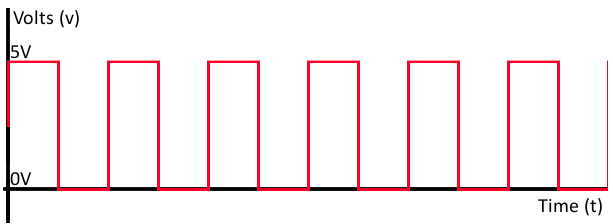

# Digital I/O on Microchip's dsPIC33EP512GP504 Processor

[Contents](../contents.md)

### Datasheets

In order to find information about the processor you are using, you can read its
corresponding "datasheet."  A datasheet is a document published by the
manufacturer of a component, and it provides both technical specifications as
well as instructions about how to work with the component.  For example, here is
a link to the datasheet for the
[dsPIC33EP512GP504](https://www.microchip.com/wwwproducts/en/dsPIC33EP512GP504).

### Digital I/O

Digital signals are electrical signals that alternate between two states, which
are often referred to as LOW and HIGH.  These states correspond to voltage
levels.

A processor can input (or output) digital signals by writing to (or reading
from) special function registers that are connected to the processors pins.
