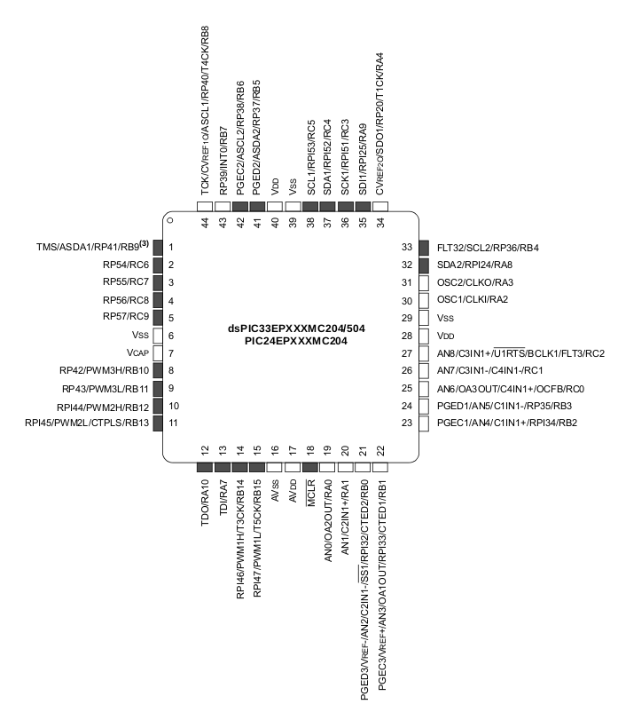
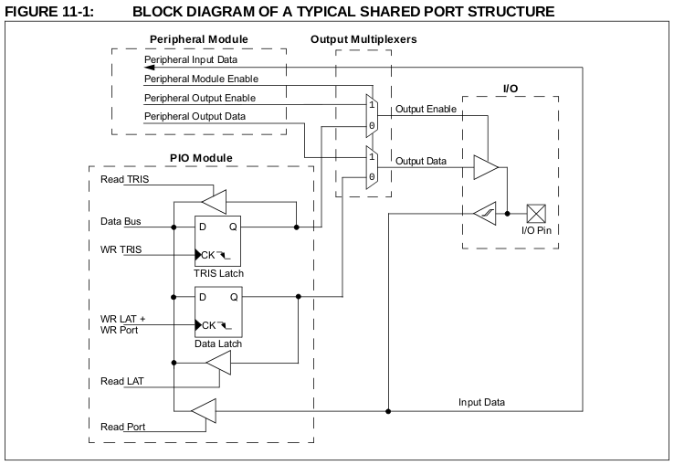
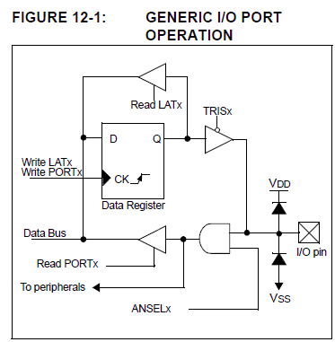

# Digital I/O on Microchip's dsPIC33EP512GP504 Processor

[Contents](../contents.md)

### Datasheets

In order to find information about the processor you are using, you can read its
corresponding "datasheet."  A datasheet is a document published by the
manufacturer of a component, and it provides both technical specifications as
well as instructions about how to work with the component.  For example, here is
a link to the datasheet for the
[dsPIC33EP512GP504](https://www.microchip.com/wwwproducts/en/dsPIC33EP512GP504).

### Digital I/O

Digital signals are electrical signals that alternate between two states, which
are often referred to as LOW and HIGH.  These states correspond to voltage
levels.

A processor can input (or output) digital signals by writing to (or reading
from) special function registers that are connected to the processor's pins.
Below is a "Pin Diagram," which indicates the functionality associated with each
pin of the processor.  As the diagram shows, some pins can serve multiple
different purposes.  It is up to the software to specify which purpose, or mode,
is active at any given time.  In this discussion, we will focus on the pins that
can be used for input and output of digital signals.

### Ports

While the term "pins" refers to metal connection points on the edge of the
processor, the term "ports" refers to hardware modules within the chip that serve
as interfaces between the processor and its pins.  The following block diagram
illustrates the structure of a typical port on a Microchip processor.

This diagram illustrates the fact that some I/O pins are shared by both an IO
module and a peripheral.  A peripheral is basically a module that provides the
processor with some kind of support or capability.  For example, UART and I2C
peripherals provide processors with circuitry that can communicate with other
devices. When they are enabled, peripherals usually take precedence over digital
input and output.  In other words, for shared ports, if the peripheral is
enabled, general purpose input and output is disabled.  By default, however,
peripherals are disabled, so we do not need to worry about them for now.  Here
is a simpler diagram, which ignores peripherals:

The "Data Register" component is a type of "flip-flop," which is a fundamental
electrical component in computer systems.  In this discussion, we will ignore
the inner-workings of flip-flops.  The important concept to know is that
flip-flops enable an electrical circuit to hold onto "state."  They are the
building blocks of memory locations called registers, which our software will
interact with in order to control the port.
